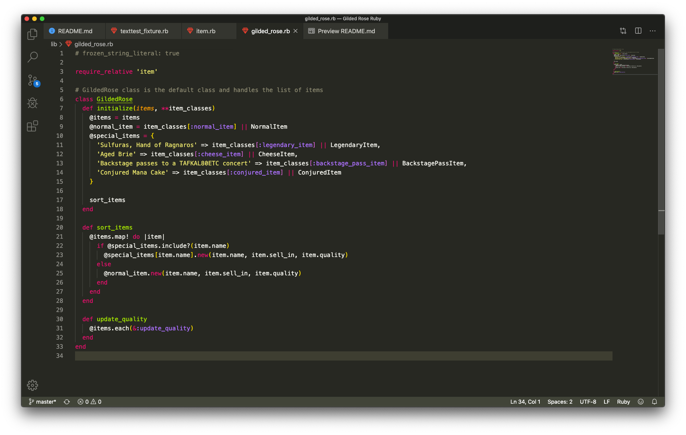
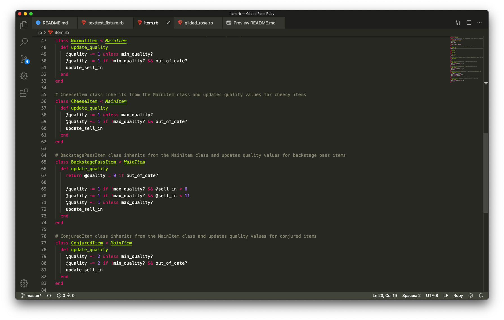

# Gilded Rose Refactoring Kata

This is my attempt at the gilded rose kata in ruby. For more information on the kata please refer to the [original Kata README.](https://github.com/domtunstill/gilded-rose-ruby/blob/master/Original%20Kata%20README.md)

Brief overview of task: The innkeeper has a sorting system that has been built by a developer that is no longer around. They would like to add a new feature to sort some new item types that weren't orignally included for. The software currently works for the original included items but is built poorly so the first task is to refactor and build rigirous tests.

## Specification

### Requirements

[Full requirements here](https://github.com/domtunstill/gilded-rose-ruby/blob/master/GildedRoseRequirements.txt)

### Acceptance Criteria

```
- All items have a SellIn value which denotes the number of days we have to sell the item /
- All items have a Quality value which denotes how valuable the item is /
- At the end of each day our system lowers both values for every item /

- Once SellIn date is passed quality degrades twice as fast /
- The Quality of an item is never negative /
- "Aged Brie" actually increases in Quality the older it gets /
- The Quality of an item is never more than 50 /
- "Sulfuras", being a legendary item, never has to be sold or decreases in Quality /
- "Sulfuras" is a legendary item and as such its Quality is 80 and it never alters.
- "Backstage passes", like aged brie, increases in Quality as its SellIn value approaches; /
    Quality increases by 2 when there are 10 days or less and /
    by 3 when there are 5 days or less
    but Quality drops to 0 after the concert

New feature. We have recently signed a supplier of conjured items. This requires an update to our system:
- "Conjured" items degrade in Quality twice as fast as normal items

- No changes to item class

- Any changes to be update Quaility and guild rose
```

## Testing Criteria

| Criteria                                                                                  |                                              Input                                              |       Output |
| ----------------------------------------------------------------------------------------- | :---------------------------------------------------------------------------------------------: | -----------: |
| All: quality of item is never negative                                                    |           Item.new(name = 'Elixir of the Mongoose', sell_in = 0, quality = 0) Days 1            |  quality = 0 |
| Sulfuras: never decrease/increase in quality                                              |         Item.new(name = 'Sulfuras, Hand of Ragnaros', sell_in = 0, quality = 80) Days 1         | quality = 80 |
| Sulfuras: never decrease/increase sellIn date                                             |         Item.new(name = 'Sulfuras, Hand of Ragnaros', sell_in = 0, quality = 80) Days 1         |  sell_in = 0 |
| Normal: item decreases quality each day                                                   |          Item.new(name = 'Elixir of the Mongoose', sell_in = 10, quality = 10) Days 1           |  quality = 9 |
| Normal: item decreases sell_in each day                                                   |          Item.new(name = 'Elixir of the Mongoose', sell_in = 10, quality = 10) Days 1           |  sell_in = 9 |
| Normal: quality twice decreases as fast after sell_in                                     |           Item.new(name = 'Elixir of the Mongoose', sell_in = 0, quality = 10) Days 1           |  quality = 8 |
| Brie: items quality never more than 50                                                    |                 Item.new(name = 'Aged Brie', sell_in = 20, quality = 50) Days 1                 | quality = 50 |
| Brie: items quality increases in value as it gets older                                   |                 Item.new(name = 'Aged Brie', sell_in = 5, quality = 10) Days 1                  | quality = 11 |
| Brie: quality increases twice as fast after sellin date                                   |                 Item.new(name = 'Aged Brie', sell_in = 0, quality = 10) Days 1                  | quality = 12 |
| Brie: sell_in value descreases by 1 each day                                              |                 Item.new(name = 'Aged Brie', sell_in = 10, quality = 10) Days 1                 |  sell_in = 9 |
| Backstage: items quality never more than 50                                               | Item.new(name = 'Backstage passes to a TAFKAL80ETC concert', sell_in = 20, quality = 50) Days 1 | quality = 50 |
| Backstage: quality increases as approach concert date                                     | Item.new(name = 'Backstage passes to a TAFKAL80ETC concert', sell_in = 20, quality = 10) Days 1 | quality = 11 |
| Backstage: quality increases twice as fast once less than 10 days until concert date      | Item.new(name = 'Backstage passes to a TAFKAL80ETC concert', sell_in = 9, quality = 20) Days 1  | quality = 22 |
| Backstage: quality increases three times as fast once less than 5 days until concert date | Item.new(name = 'Backstage passes to a TAFKAL80ETC concert', sell_in = 4, quality = 30) Days 1  | quality = 33 |
| Backstage: Quality drops to 0 after the concert                                           | Item.new(name = 'Backstage passes to a TAFKAL80ETC concert', sell_in = 0, quality = 50) Days 1  |  quality = 0 |
| Backstage: sell_in value descreases by 1 each day                                         | Item.new(name = 'Backstage passes to a TAFKAL80ETC concert', sell_in = 10, quality = 10) Days 1 |  sell_in = 9 |
| Conjured: decrease in quality twice as fast as normal items                               |            Item.new(name = 'Conjured Mana Cake', sell_in = 10, quality = 10) Days 1             |  sell_in = 9 |
| Conjured: decrease in quality twice as fast as normal items                               |            Item.new(name = 'Conjured Mana Cake', sell_in = 10, quality = 10) Days 1             |  quality = 8 |
| Conjured: decrease in quality twice as fast as normal items, passed sell_in date          |             Item.new(name = 'Conjured Mana Cake', sell_in = 0, quality = 10) Days 1             |  quality = 6 |

### Edge cases

- User adds items with quality more than 50 the code carries on adding to the quality - not part of original programme or brief but make client aware of it
- User adds items with quality less than 0 - not part of original programme or brief but make client aware of it

## Approach and Code Structure

### Approach

- First task was to sort out the directory structure. I created 'spec' and 'lib' folders to store these fils correctly.
- Then I set up RSpec testing framework correctly and added simplecov coverage checker and rubocop linter.
- Then I used the existing texttest_fixture.rb to test the current working output and saved this to the following [file.](https://github.com/domtunstill/gilded-rose-ruby/spec/Golden%20Master%20Orig%20Extra%20Days)
- Using this output and the acceptance criteria, the next step was to break this into testing criteria. These went by simpliest criteria first and were grouped by item type.
- Once the testing criteria covered all the output and the acceptance criteria, I wrote tests for each of these and RSpec was run to check all tests were passing.
- Next, I idenitfied patterns in the code and refactored small sections at a time. Generally the code was 3 main if statements with if statements in between. I picked the simplest one of these, whose purpose was to remove a 'sell_in' day from each item except legendary items.
- I refactored this into a method, breaking one test at a time and then passing it again with the new code.
- I repeated this process for the other 2 if statements, breaking each statement down further and identifying which item they were for and which tests they affacted. I created methods for each item adding one piece of functionality at a time.
- Once this process was complete, I was left with the original method calling different 'item' methods based on the which item it was. It seemed logicial that these items should become their own classes and they could then update thier own 'quality' by each having an #update_quality method.
- However the main 'Item' class could not be altered, so I created classed that inhereited from the original Item class.
- Upon doing this I realised there were multiple checker methods that a lot of the 'Item' objects needed i.e. has the maximum quality been reached. Therefore I created a 'MainItem' class which inherited from 'Item' and then individual item classes inherited from this.
- **I was conscious of not changing the way the user interacted with the program**, so this led me to creating 'sort_items' method within the main 'GildedRose; class. This allowed the user to create a new instance of 'GildedRose' as before by giving it an array on normal 'Item' objects.
- On instantiation of 'GildedRose', the class sorts the 'Item' objects in the array into the relevent child objects.
- Then when #update_quality is called from 'GildedRose' as before it in turn calls #update_quality on each 'Item' and then each 'Item' can update itself in the correct manner depending on what type of item it is.

### Structure

The code is split into 2 main classes.

GildedRose Class

- This is the main class the user interacts with and is the 'manager class'
- It is responsible for sorting the items.

Item Class

- This is the default Item class and was not touched. However 6 child classes were created from the main item class.
- The class has attributes about each item like name, sell_in value and quality.

MainItem Class

- This class has the checker methods for the item classes like #max_quality? and #out_of_date?

LegendaryItem Class

- This class inherits from the Item class rather than MainItem as it did not require the checker methods. As legendary items remain unchanged, the class purely reutrns nil

NormalItem Class

- This class inherits from the MainItem Class and updates the quality of a normal item

CheeseItem Class

- This class inherits from the MainItem Class and updates the quality of a cheese item

ConjuredItem Class

- This class inherits from the MainItem Class and updates the quality of a conjured item

BackstagePassItem Class

- This class inherits from the MainItem Class and updates the quality of a backstage pass item

## App

Ruby version '2.6.3'

### Testing and Code Quality

Framework - RSpec

Linter - Rubocop

Test Coverage Analyser - Simplecov

## Installation

Run the following command in the project directory:

```
$ bundle install
```

## Usage

Add the following to the top of your project files which require the Bank app or use in IRB (or similar).

```ruby
require 'gilded_rose'
```

Example below of a project file using the Bank app.

```ruby
require 'gilded_rose'

gilded_rose = GildedRose.new(
    [
        Item.new(name = 'Aged Brie', sell_in = 2, quality = 10)
        Item.new(name = '+5 Dexterity Vest', sell_in = 10, quality = 20)
    ])

giled_rose.update_quality 
# changes the '+5 Dexterity Vest' to: name = '+5 Dexterity Vest', sell_in = 9, quality = 19
# changes the 'Aged Brie' to: name = 'Aged Brie', sell_in = 1, quality = 11
```

### App Screenshot

GildedRose Class


Item Class


Run the following command in the project directory to run the tests:

```
$ rspec
```

Run the following command in the project directory to check code quality:

```
$ rubocop
```

## Contributing

## License

[MIT](domtunstill)
